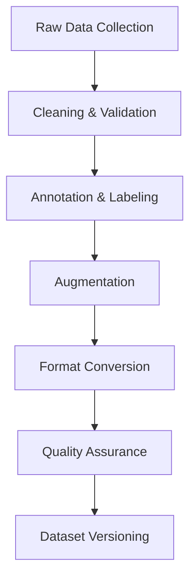

# Fine-Tuning Strategy and Dataset Preparation

## Overview

This document outlines the fine-tuning strategy and dataset preparation process for optimizing the ML models in the Claude Control system.

## 1. Dataset Preparation

### 1.1 Data Sources

```yaml
sources:
  user_interactions:
    - command_logs
    - error_reports
    - feedback_responses
    - correction_patterns
    
  synthetic_data:
    - template_generation
    - pattern_augmentation
    - error_simulation
    - edge_case_creation
    
  system_logs:
    - execution_traces
    - resource_metrics
    - performance_data
    - error_states
```

### 1.2 Data Processing Pipeline



## 2. Dataset Structure

### 2.1 Command Understanding Dataset

```yaml
command_dataset:
  format: jsonl
  fields:
    - raw_input: string
    - normalized_input: string
    - command_type: enum
    - parameters: object
    - context: object
    - success: boolean
    - execution_time: number
    
  annotations:
    - intent_labels
    - parameter_boundaries
    - entity_tags
    - complexity_score
    
  splits:
    train: 70%
    validation: 15%
    test: 15%
```

### 2.2 Error Recovery Dataset

```yaml
error_dataset:
  format: jsonl
  fields:
    - failed_command: object
    - error_type: string
    - error_message: string
    - correction: object
    - recovery_steps: array
    - success_indicator: boolean
    
  annotations:
    - error_category
    - severity_level
    - recovery_complexity
    - root_cause
```

## 3. Fine-Tuning Strategy

### 3.1 Model-Specific Approaches

```yaml
command_predictor:
  method: gradual_fine_tuning
  stages:
    - domain_adaptation
    - task_specific_tuning
    - error_recovery_specialization
    
  hyperparameters:
    learning_rate: 1e-5
    batch_size: 16
    epochs_per_stage: 5
    warmup_ratio: 0.1
    
intent_classifier:
  method: progressive_fine_tuning
  stages:
    - base_model_adaptation
    - intent_specialization
    - context_integration
    
  hyperparameters:
    learning_rate: 2e-5
    batch_size: 32
    total_epochs: 10
    label_smoothing: 0.1
```

### 3.2 Training Regimes

```yaml
training_schedule:
  initial_phase:
    duration: 1000_steps
    learning_rate: linear_warmup
    batch_size: start_small
    
  main_phase:
    duration: 10000_steps
    learning_rate: cosine_decay
    batch_size: gradual_increase
    
  fine_tuning_phase:
    duration: 2000_steps
    learning_rate: small_constant
    batch_size: full_size
```

## 4. Data Augmentation

### 4.1 Augmentation Techniques

```yaml
techniques:
  command_variation:
    - synonym_replacement
    - word_order_shuffling
    - parameter_substitution
    - style_transformation
    
  error_simulation:
    - parameter_corruption
    - context_modification
    - resource_constraints
    - timing_issues
    
  context_augmentation:
    - state_variation
    - history_modification
    - preference_alteration
    - load_simulation
```

### 4.2 Quality Control

```yaml
quality_checks:
  semantic_validity:
    method: expert_rules
    confidence_threshold: 0.9
    
  syntactic_correctness:
    method: grammar_check
    error_tolerance: 0.01
    
  execution_validation:
    method: dry_run
    success_rate_threshold: 0.95
```

## 5. Evaluation Framework

### 5.1 Metrics

```yaml
evaluation_metrics:
  accuracy:
    - command_prediction
    - intent_classification
    - parameter_extraction
    - error_recovery
    
  efficiency:
    - inference_time
    - resource_usage
    - memory_footprint
    - throughput
    
  robustness:
    - error_tolerance
    - noise_resistance
    - context_sensitivity
    - edge_case_handling
```

### 5.2 Validation Process

```yaml
validation:
  continuous_evaluation:
    frequency: hourly
    metrics_threshold: 0.95
    regression_detection: enabled
    
  periodic_testing:
    frequency: daily
    full_test_suite: true
    performance_profiling: enabled
    
  human_evaluation:
    frequency: weekly
    sample_size: 100
    criteria:
      - accuracy
      - naturalness
      - effectiveness
```

## 6. Monitoring and Maintenance

### 6.1 Performance Tracking

```yaml
tracking:
  metrics_collection:
    frequency: real_time
    aggregation_window: 1h
    storage_retention: 30d
    
  alerting:
    performance_degradation: true
    error_rate_increase: true
    resource_exhaustion: true
    
  reporting:
    daily_summary: true
    weekly_analysis: true
    monthly_trends: true
```

### 6.2 Model Updates

```yaml
update_strategy:
  trigger_conditions:
    - performance_drop
    - error_rate_increase
    - new_pattern_emergence
    - resource_optimization
    
  validation_process:
    - canary_testing
    - a_b_comparison
    - rollback_capability
    
  deployment:
    method: gradual_rollout
    monitoring: intensive
    fallback: enabled
```

## 7. Dataset Versioning

### 7.1 Version Control

```yaml
versioning:
  strategy: git_lfs
  metadata:
    - dataset_stats
    - preprocessing_params
    - augmentation_config
    - quality_metrics
    
  tracking:
    - data_lineage
    - transformation_history
    - usage_statistics
    - performance_impact
```

### 7.2 Documentation

```yaml
documentation:
  dataset:
    - source_description
    - preprocessing_steps
    - annotation_guidelines
    - quality_metrics
    
  models:
    - architecture_details
    - training_parameters
    - performance_metrics
    - usage_instructions
```

## Next Steps

1. Set up data collection pipeline
2. Implement preprocessing steps
3. Create augmentation pipeline
4. Establish evaluation framework
5. Deploy monitoring system
6. Begin initial fine-tuning
7. Implement continuous evaluation