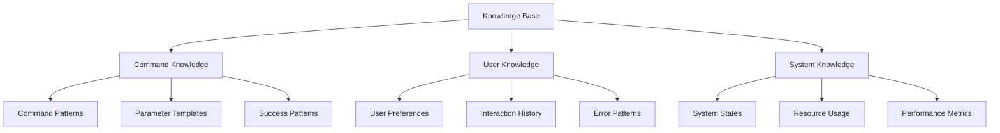

# Knowledge Base Structure and Management

## Overview

This document outlines the structure and management of the knowledge base that powers the Claude Control system's learning capabilities.

## 1. Knowledge Base Architecture

### 1.1 Core Components

```yaml
components:
  command_patterns:
    storage: vector_store
    embedding_model: sentence-transformers
    index_type: faiss
    
  user_interactions:
    storage: time_series_db
    retention: 90_days
    aggregation: hierarchical
    
  system_state:
    storage: graph_db
    relationships: bidirectional
    temporal_tracking: enabled
```

### 1.2 Data Organization



## 2. Knowledge Acquisition

### 2.1 Learning Sources

```yaml
sources:
  direct_interaction:
    - user_commands
    - feedback_responses
    - error_corrections
    
  system_observation:
    - execution_patterns
    - resource_usage
    - error_logs
    
  derived_knowledge:
    - pattern_analysis
    - statistical_inference
    - temporal_correlations
```

### 2.2 Learning Pipeline

```yaml
pipeline:
  collection:
    frequency: real_time
    validation: enabled
    deduplication: true
    
  processing:
    cleaning: true
    normalization: enabled
    feature_extraction: true
    
  integration:
    validation: strict
    conflict_resolution: version_control
    indexing: automatic
```

## 3. Knowledge Organization

### 3.1 Command Knowledge

```yaml
command_knowledge:
  patterns:
    structure:
      - command_template
      - parameter_patterns
      - success_conditions
    metadata:
      - frequency
      - success_rate
      - resource_requirements
      
  relationships:
    - dependencies
    - alternatives
    - compositions
    - conflicts
```

### 3.2 User Knowledge

```yaml
user_knowledge:
  preferences:
    - command_style
    - common_patterns
    - error_tendencies
    
  history:
    - successful_commands
    - failed_attempts
    - learning_progression
    
  context:
    - expertise_level
    - usage_patterns
    - temporal_preferences
```

## 4. Knowledge Maintenance

### 4.1 Update Mechanisms

```yaml
updates:
  scheduled:
    frequency: daily
    scope: full
    validation: required
    
  incremental:
    frequency: real_time
    scope: delta
    validation: fast
    
  emergency:
    trigger: critical_error
    scope: affected_components
    validation: strict
```

### 4.2 Validation Process

```yaml
validation:
  consistency:
    - schema_validation
    - relationship_check
    - temporal_consistency
    
  quality:
    - accuracy_metrics
    - completeness_check
    - relevance_scoring
    
  integration:
    - conflict_detection
    - merge_validation
    - impact_analysis
```

## 5. Knowledge Application

### 5.1 Retrieval Mechanisms

```yaml
retrieval:
  vector_search:
    index: faiss
    similarity: cosine
    k_nearest: 5
    
  pattern_matching:
    method: regex
    fuzzy_matching: enabled
    threshold: 0.8
    
  context_aware:
    user_context: true
    system_state: true
    temporal_context: true
```

### 5.2 Application Patterns

```yaml
application:
  command_enhancement:
    - parameter_suggestion
    - validation_rules
    - optimization_hints
    
  error_prevention:
    - pre_execution_checks
    - resource_validation
    - conflict_detection
    
  performance_optimization:
    - resource_allocation
    - execution_planning
    - caching_strategy
```

## 6. Knowledge Evolution

### 6.1 Learning Mechanisms

```yaml
learning:
  pattern_discovery:
    method: clustering
    frequency: daily
    confidence_threshold: 0.8
    
  relationship_learning:
    method: graph_analysis
    update_frequency: weekly
    minimum_support: 0.1
    
  temporal_learning:
    method: sequence_mining
    window_size: 30d
    pattern_length: 5
```

### 6.2 Adaptation Strategies

```yaml
adaptation:
  command_patterns:
    - frequency_based
    - success_rate_based
    - resource_optimized
    
  user_patterns:
    - preference_based
    - expertise_based
    - context_aware
    
  system_patterns:
    - load_based
    - resource_based
    - performance_based
```

## 7. Monitoring and Metrics

### 7.1 Knowledge Quality

```yaml
quality_metrics:
  coverage:
    - command_coverage
    - parameter_coverage
    - error_coverage
    
  accuracy:
    - prediction_accuracy
    - suggestion_relevance
    - error_prevention_rate
    
  freshness:
    - update_frequency
    - staleness_detection
    - relevance_decay
```

### 7.2 Usage Metrics

```yaml
usage_metrics:
  retrieval:
    - query_latency
    - hit_rate
    - relevance_score
    
  application:
    - success_rate
    - optimization_impact
    - resource_efficiency
    
  evolution:
    - learning_rate
    - adaptation_speed
    - improvement_trends
```

## Next Steps

1. Implement knowledge base structure
2. Set up data collection pipelines
3. Establish validation processes
4. Deploy monitoring systems
5. Begin knowledge acquisition
6. Enable continuous learning