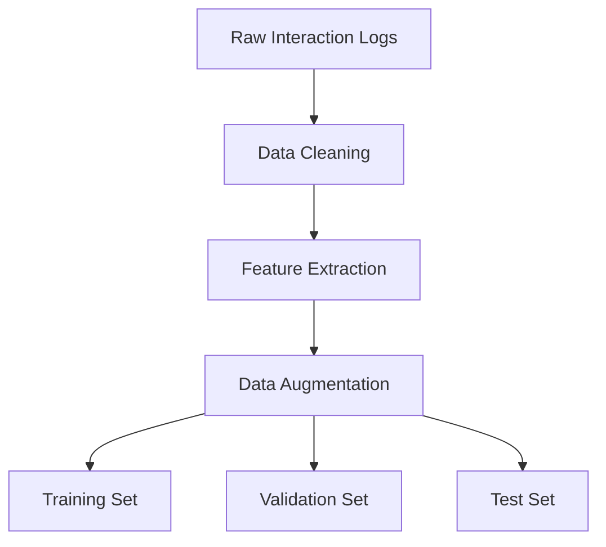
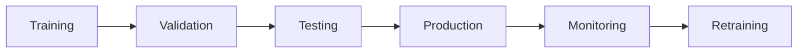
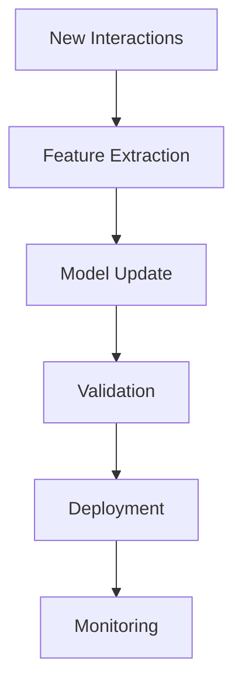

# Training Pipeline for Claude Control ML System

## Overview

This document outlines the training pipeline for the machine learning components of the Claude Control system, including data preparation, model training, evaluation, and deployment.

## 1. Data Collection and Preparation

### 1.1 Data Sources
- User interactions with command history
- System execution logs
- Error reports and recovery patterns
- User feedback and corrections
- System state snapshots

### 1.2 Data Processing Pipeline


### 1.3 Feature Engineering
- Text embeddings from user commands
- System state vectors
- Command success/failure indicators
- Temporal features
- User context features

## 2. Model Training

### 2.1 Command Prediction Model

#### Training Process
1. Initialize BERT-based encoder
2. Fine-tune on command dataset
3. Train LSTM layers
4. Add attention mechanism
5. Train dense layers
6. End-to-end fine-tuning

#### Hyperparameter Optimization
```yaml
hyperparameters:
  learning_rate:
    range: [1e-5, 1e-3]
    scale: log
  batch_size:
    range: [16, 128]
    scale: linear
  lstm_units:
    range: [128, 512]
    scale: linear
  attention_heads:
    range: [4, 16]
    scale: linear
```

### 2.2 Intent Classification Model

#### Training Steps
1. Prepare labeled intent dataset
2. Fine-tune BERT classifier
3. Train intent-specific heads
4. Calibrate confidence scoring
5. Validate on held-out set

#### Model Architecture
```yaml
model:
  encoder:
    type: BERT
    size: base
    layers: 12
  classifier:
    type: MultiHead
    heads: 8
    dropout: 0.1
  output:
    type: Dense
    activation: softmax
```

### 2.3 Reinforcement Learning

#### Policy Training
1. Initialize policy network
2. Collect interaction episodes
3. Compute rewards
4. Update policy gradients
5. Validate improvements

#### Reward Function
```python
def compute_reward(state, action, next_state):
    return (
        0.5 * command_success_rate +
        0.3 * user_satisfaction +
        0.1 * execution_efficiency +
        0.1 * resource_efficiency
    )
```

## 3. Evaluation Framework

### 3.1 Metrics

#### Command Prediction
- Top-1/Top-5 accuracy
- Mean reciprocal rank
- Command completion time
- Resource utilization

#### Intent Classification
- Precision/Recall/F1
- Confusion matrix
- ROC/AUC curves
- Confidence calibration

#### Reinforcement Learning
- Average reward
- Policy improvement rate
- Convergence speed
- Stability metrics

### 3.2 Evaluation Protocol



### 3.3 A/B Testing
- Control vs. experimental models
- User satisfaction metrics
- Performance comparisons
- Statistical significance tests

## 4. Online Learning

### 4.1 Continuous Training Pipeline



### 4.2 Model Versioning
```yaml
version_control:
  model_registry:
    path: /models
    versioning: semantic
    metadata:
      - performance_metrics
      - training_data_hash
      - hyperparameters
```

### 4.3 Update Criteria
- Performance degradation
- New command patterns
- Concept drift detection
- Resource optimization
- User feedback signals

## 5. Deployment Strategy

### 5.1 Model Serving

#### Production Pipeline


#### Model Formats
```yaml
formats:
  - tensorflow_js
  - onnx
  - tensorrt
  - saved_model
```

### 5.2 Monitoring and Alerts

#### Metrics to Monitor
- Inference latency
- Memory usage
- CPU utilization
- Prediction accuracy
- Error rates

#### Alert Thresholds
```yaml
alerts:
  latency_p95_ms: 100
  error_rate_percent: 5
  memory_usage_mb: 512
  accuracy_drop_percent: 10
```

## 6. Safety and Fallbacks

### 6.1 Safety Measures
- Input validation
- Output verification
- Resource limits
- Timeout mechanisms
- Error recovery

### 6.2 Fallback Strategy
```yaml
fallbacks:
  - rule_based_system
  - previous_model_version
  - default_responses
  - human_intervention
```

## 7. Performance Optimization

### 7.1 Model Optimization
- Quantization
- Pruning
- Knowledge distillation
- Model compression
- Batch inference

### 7.2 Resource Management
```yaml
resources:
  memory_limit_mb: 1024
  cpu_cores: 2
  gpu_memory_mb: 2048
  batch_size: 32
```

## 8. Training Infrastructure

### 8.1 Hardware Requirements
```yaml
training:
  cpu: 8 cores
  memory: 16GB
  gpu: NVIDIA T4
  storage: 100GB SSD

inference:
  cpu: 2 cores
  memory: 4GB
  storage: 20GB SSD
```

### 8.2 Software Stack
```yaml
dependencies:
  - tensorflow==2.13.0
  - transformers==4.30.0
  - pytorch==2.0.0
  - scikit-learn==1.2.2
  - numpy==1.23.5
  - pandas==2.0.0
```

## Next Steps

1. Set up data collection pipeline
2. Implement feature engineering
3. Train initial models
4. Establish evaluation framework
5. Deploy monitoring system
6. Begin A/B testing